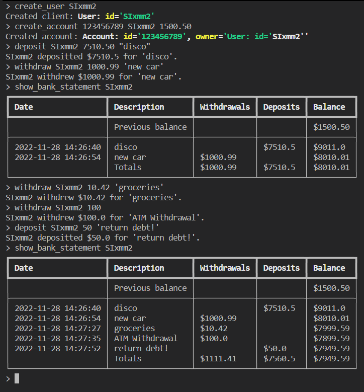

# Сервис по работе банка со счетами клиентов

# Тестовое задание от компании НТ Прогресс

## Перед запуском

Необходимо убедиться о наличии [Docker](https://www.docker.com/) на системе.

## Скачать

Перейдите в папку, в которую хотите скачать файлы.
Перейдите в `PowerShell`/`bash`/`zsh`/`git bash`/другую консоль.
Введите `git clone https://github.com/SXHRYU/nt-progress_slavaitru`

### Запуск

`docker build --tag python-slava .`
`docker run -it python-slava`
**Примечание**: Обязательно укажите флаг `-it`, поскольку это интерактивное приложение, для которого нужен ввод с клавиатуры.

### Команды

Чтобы просмотреть список всех команд, передаваемые параметры и информацию о них, введите `help`/`-h`/`--help` либо просто введите любое слово, не содержащееся в списке снизу:

*   create_user;
*   create_account;
*   delete_user;
*   delete_account;
*   display_users;
*   display_accounts;
*   deposit;
*   withdraw;
*   show_bank_statement;
*   exit.

### Workflow

**Легенда**:
обязательная `команда`
обязательный `<параметр>`
необязательный `[<параметр>]`

1)  Сначала нужно создать пользователя (клиента) командой `create_user <client_id>`
2)  Далее этому пользователю нужно дать счёт (аккаунт) (у каждого пользователя может быть только 1 счёт) командой `create_account <account_id> <client_id> [<initial_balance>]`
    2.1)    Клиент может существовать без аккаунта, а аккаунт без клиента - нет. Поэтому можно удалить аккаунт, сохранив пользователя, но не наоборот.
3)  Далее можно либо положить средства на счёт, либо снять их соответствующими командами `deposit <client_id> <amount> [<description>]`/`withdraw <client_id> <amount> [<description>]`
    3.1)    Принимается возможным, что у клиента может быть отрицательная сумма на счету (кредит)
4)  Просмотреть все операции по счёту можно командой `show_bank_statement <client_id> [<since>] [<till>]`

### Тесты

Тесты находятся в файле `test_main.py`.

### Комментарии

Активно использовал **Test-Driven Development** и подход **Red-Green-Refactor**, за счёт чего много ошибок в будущем удалось избежать.
Сходу я подумал использовать пакет `argparse` из стандартной библиотеки. Поскольку я впервые с ним работал, я потратил значительное времени на его изучение. В итоге, когда я понял, что он не подходит для этой задачи, прошло уже много времени и нужно было думать о новом подходе к решению.
Не использовал типизацию, так как решил сэкономить так на времени.

### Контакты

[Telegram](https://t.me/SXRu1)
[Мой сайт](https://slavaitru.online/menu)
